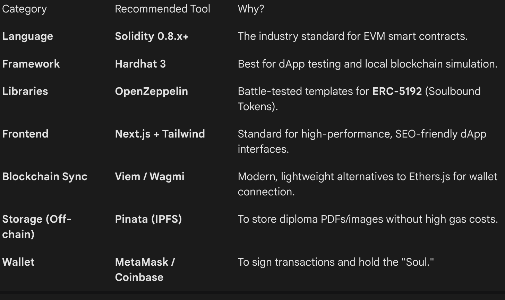
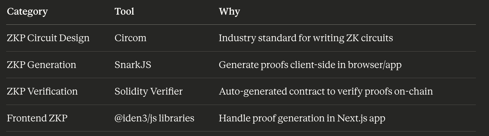

# Decentralized Academic Credential Verification

### Moving beyond paper diplomas with Soulbound Tokens.

The current process for verifying academic credentials is slow, manual, and prone to fraud. **SBT-Verify** is a blockchain-based solution that replaces physical diplomas with **Soulbound Tokens (SBTs)**—non-transferable NFTs that allow employers to instantly verify a candidate's education without ever contacting the university.

---

## The Core Concept

Traditional diplomas rely on a centralized authority to vouch for an individual. This project decentralizes that trust.

By using the **ERC-5192** standard, we create digital credentials that are:

* **Immutable:** Cannot be forged or tampered with.
* **Soulbound:** Tied to a specific wallet address; they cannot be sold, traded, or transferred.
* **Instantly Verifiable:** Validated via smart contract in seconds.

---

## The Ecosystem Flow: The Trust Triangle

The system operates through three primary actors:

1. **The Issuer (The University):** Establishes a verified Decentralized Identifier (DID).
    - Mints the SBT directly to the student's wallet upon graduation.
    - Hosts encrypted metadata (GPA, Degree Type) on IPFS.

2. **The Holder (The Student):** Maintains a non-custodial wallet (e.g., MetaMask).
    - Owns their academic data permanently.
    - Provides proof of ownership to potential employers via their wallet address.

3. **The Verifier (The Employer):**
    - Queries the blockchain to check if the student's wallet contains the required SBT.
    - Confirms the SBT was minted by the University's official contract address.
    - Receives instant "Pass/Fail" verification.

---

## Key Considerations & Caveats

* **Privacy:** To comply with GDPR and student privacy, sensitive data (like specific grades) should be stored off-chain or protected using **Zero-Knowledge Proofs (ZKPs)**.
* **Revocation:** While the blockchain is "permanent," the smart contract includes a `burn` function that only the University (Issuer) can trigger in case a degree is rescinded.
* **Identity Linkage:** The system assumes the wallet belongs to the student. Future iterations will look at linking wallets to government-issued IDs.

---

## Technical Stack for the project (might change in the future)

---

## Additional tech-stack to support ZKP (also might change with other ZKP implementations)

